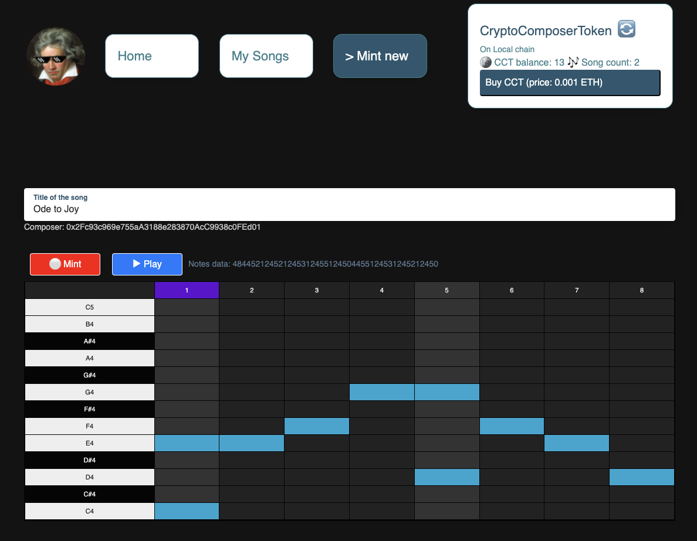

# [Crypto Composer](https://crypto-composer.bangtoven.com/)

- Mint NFTs storing music data, in a abstractive and discrete form
- Ensure originality and uniqueness by checking hash
- Play back the songs registered on blockchain



## User workflows

- Sign in with Ethereum provider
- Browe songs and see metadata (title, composer account)
- Play songs
  - by selecting one from the list
  - or accessing directly via link. e.g. https://crypto-composer.bangtoven.com/songs/0
- Buy CCT(CryptoComposerToken) to pay for minting new songs
- Write a new song and mint it as NFT
- (Access them on NFT marketplaces like OpenSea. e.g. [Song #1 on Crypto Composer](https://testnets.opensea.io/assets/0xde58a83bc2634753143c555dd08d47d22463e71f/1)

## Architecture and directory structure

### Smart contracts

Bootstraped with [Truffle](https://github.com/trufflesuite/truffle),
and deployed on [Ropsten](https://ropsten.etherscan.io/address/0xA27FACD3FB95E8a159f69522151caA6DA4224EC2)
and [Rinkeby](https://rinkeby.etherscan.io/address/0xDE58a83BC2634753143C555dD08d47D22463E71f)

```
- contracts
 - CryptoComposer.sol   - deployed. checks payment and call minter
 - CryptoNFTMinter.sol  - inherited by CryptoComposer. manages minting
 - CryptoComposerToken.sol       - ERC20 token to use CryptoComposer.
 - CryptoComposerTokenVendor.sol - manages price and minting of CCT.
- migrations
- tests
```

### Frontend

React app built with [next.js](https://github.com/vercel/next.js/) accessible at https://crypto-composer.bangtoven.com/

Referenced [Reactronica](https://github.com/unkleho/reactronica) to build DAWStepsEditor

```
- pages
- components
- hooks
- styles
- public
```

## Installing instructions

### Deploy smart contracts to local blockchain

```
$ yarn install
$ ganache-cli -p 8545
$ truffle migrate
```

- Run Ganache on port 8545
-

## Ethereum account for certificatation NFT

```
jungho.eth
0xB8E1aCe6Aa298777552eda47B71857201D662134
```
